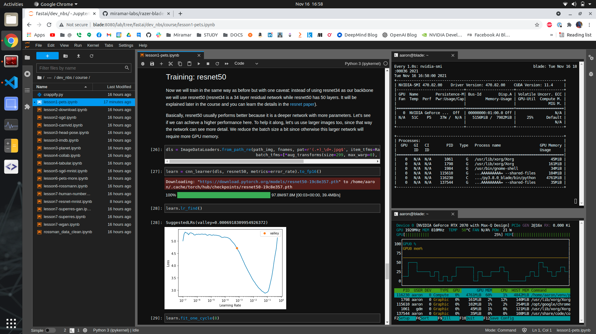

# Razer Blade 15 AI Workstation Configuration

This is how I turn my [Razer Blade 15](https://www.amazon.com/gp/product/B086MFZBM9/ref=ppx_yo_dt_b_search_asin_title?ie=UTF8&th=1) Gaming Laptop into an AI workstation. Specs:
   - 64 GB RAM (upgraded)
   - 1TB SSD (upgraded - added SSD disk.. LVM expansion)
   - NVidia GeForce RTX 2070 Max-Q GPU

## Install Ubunti 20.04
 - Use a USB stick to install Ubuntu
   - remember to select LVM when configuring disks (if you ever want to expand your root volume with additional disks)
 - Fix the'suspend on lid closed' bug by editing GRUB:
   - NOTE: this is an issue with my particular laptop hardware/BIOS and may be OPTIONAL for you
   - edit /etc/default/grub:

        add `button.lid_init_state=open`:

          GRUB_CMDLINE_LINUX_DEFAULT="quiet splash button.lid_init_state=open"
          GRUB_CMDLINE_LINUX="button.lid_init_state=open"
   - rebuild grub:

	      update-grub
- Generate SSH keys:

        ssh-keygen

- Add your SSH public key to Github

- Clone this repo and run:

        bash all.sh
## Installed Software
  - vscode
  - sublime text
  - nomachine
  - mathematica
  - NVidia driver
  - CUDA Toolikt/cuDNN/nvvp/nvtop
  - jupyterlab
  - PyTorch (GPU Build)
  - Tensorflow2 (GPU build)
  - ML stack: numpy/scipy/pandas/matplotlib ...
  - fast.ai
  - OpenAI Gym

